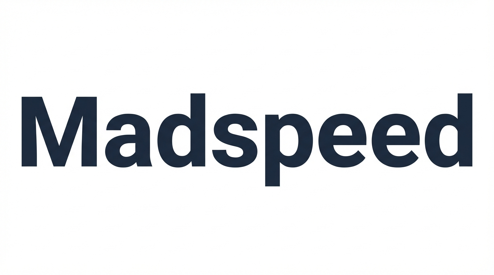

<div align="center">
  
  <h1>RalphGrip</h1>
  <p><strong>프로젝트를 즐겁게 관리하는 방법</strong></p>
  <p>계층 트리, 추적성 매트릭스, 의존성 그래프로 프로젝트의 전체 흐름을 놓치지 않는 ALM 도구</p>
  <p>
    <a href="https://ralphgrip.com">ralphgrip.com</a> ·
    <a href="./mcp-server/README.md">MCP Server 문서</a>
  </p>
</div>

## Demo Video

- **데모 영상**: [RalphGrip product walkthrough (recorded on March 16, 2026)](./public/videos/ralphgrip-demo-2026-03-16.mp4)

## Overview

RalphGrip은 작업을 트리 구조로 정리하고, 프로젝트 간 의존성과 진행 흐름을 한 화면에서 파악할 수 있게 만든 AI 기반 프로젝트 관리 도구입니다.

현재 공개 서비스는 **https://ralphgrip.com** 에서 운영 중이며, 이 저장소에는 다음이 함께 들어 있습니다.

- **웹 앱**: Next.js 기반 프로젝트/작업 관리 UI
- **MCP Server**: AI 에이전트가 RalphGrip 프로젝트를 읽고 수정할 수 있는 MCP 서버
- **Orchestrator**: 작업을 폴링하고 에이전트 실행을 연결하는 자동화 런타임

## Key Features

- **프로젝트 ALM 뷰**: 문서 / Kanban / Timeline / List / Graph 뷰 제공
- **계층형 작업 구조**: 프로젝트 → 폴더/트래커 → 작업 아이템 트리 관리
- **의존성 추적**: 작업 간, 프로젝트 간 링크와 흐름 시각화
- **내 작업 중심 워크스페이스**: 담당/생성/멘션 기준으로 개인 작업 정리
- **사업현황 대시보드**: 프로젝트 진행률, 일정 범위, 상태를 크로스 프로젝트로 요약
- **AI 에이전트 관리**: 에이전트 생성, 상태 확인, 담당자 할당, API Key 발급
- **MCP 연동**: Claude Code 같은 에이전트 툴이 RalphGrip를 직접 조작 가능
- **외부 리소스 연결**: Google Drive, 외부 링크, 댓글/멘션, 알림 흐름 지원

## Tech Stack

- **Frontend**: Next.js 16, React 19, TypeScript
- **UI**: Tailwind CSS 4, shadcn/ui, Framer Motion
- **Backend / DB**: Supabase, PostgreSQL, Realtime, RLS
- **AI / Automation**: MCP, RalphGrip Orchestrator
- **Workspace**: pnpm workspace (`web`, `mcp-server`, `orchestrator`)

## Repository Structure

```text
.
├── src/                  # RalphGrip 웹 앱
├── public/               # 로고 및 정적 자산
├── supabase/migrations/  # DB 스키마 및 RLS 마이그레이션
├── mcp-server/           # @ralphgrip/mcp-server
├── orchestrator/         # 작업 폴링 및 에이전트 실행 오케스트레이터
├── docs/                 # 기능 스펙 및 설계 메모
├── PRD.md                # 제품 요구사항 문서
└── REQUIREMENTS.md       # 초기 요구사항 요약
```

## Getting Started

### 1) Prerequisites

- Node.js 20+
- pnpm
- Supabase 프로젝트

### 2) Install dependencies

```bash
pnpm install
```

### 3) Configure environment variables

`.env.local.example`을 복사해 `.env.local`을 만들고 값을 채워주세요.

```bash
cp .env.local.example .env.local
```

기본적으로 필요한 값:

- `NEXT_PUBLIC_SUPABASE_URL`
- `NEXT_PUBLIC_SUPABASE_ANON_KEY`
- `SUPABASE_SERVICE_ROLE_KEY`
- `NEXT_PUBLIC_APP_URL`
- `INTERNAL_API_KEY`

선택 기능을 쓰려면 아래 값도 설정하세요.

- Google Drive 연동: `NEXT_PUBLIC_GOOGLE_CLIENT_ID`, `GOOGLE_CLIENT_SECRET`
- Slack 연동: `SLACK_BOT_TOKEN`, `SLACK_SIGNING_SECRET`

### 4) Apply Supabase migrations

`supabase/migrations` 아래 SQL을 사용해 데이터베이스 스키마를 적용하세요.

### 5) Run the app

```bash
pnpm dev
```

브라우저에서 `http://localhost:3000`을 열면 됩니다.

## Development Commands

### Web app

```bash
pnpm dev
pnpm lint
pnpm typecheck
pnpm test
pnpm build
```

### MCP Server

```bash
pnpm --filter @ralphgrip/mcp-server build
pnpm --filter @ralphgrip/mcp-server test
```

자세한 연결 방법은 [`mcp-server/README.md`](./mcp-server/README.md)를 참고하세요.

### Orchestrator

```bash
pnpm --filter @ralphgrip/orchestrator build
pnpm --filter @ralphgrip/orchestrator test
```

## What is included

이 저장소는 아래 시나리오를 직접 개발하거나 확장할 수 있도록 구성되어 있습니다.

- 팀 단위 프로젝트/작업 관리 UI
- 에이전트 담당자 모델과 에이전트 관리 화면
- AI 에이전트용 MCP 인터페이스
- 작업 상태 전이와 자동화 런타임 실험 기반
- Google Drive / Slack 같은 외부 협업 도구 연결

## Notes for public deployment

- 실제 서비스 기준 공개 주소는 **https://ralphgrip.com** 입니다.
- 프로덕션 환경에서는 Supabase Auth / RLS / Service Role Key 관리가 필수입니다.
- MCP 및 오케스트레이터 기능은 별도 런타임/배포 구성이 필요합니다.
- 저장소에는 비밀 키나 운영 환경 설정이 포함되어 있지 않습니다.

## Related Docs

- [PRD.md](./PRD.md)
- [REQUIREMENTS.md](./REQUIREMENTS.md)
- [docs/spec-agent-management.md](./docs/spec-agent-management.md)
- [docs/spec-project-pipeline.md](./docs/spec-project-pipeline.md)
- [mcp-server/README.md](./mcp-server/README.md)
